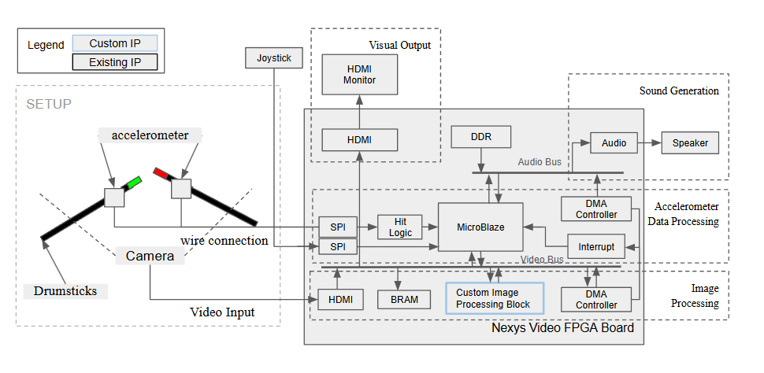

# ece532_group20

# Project Description
The project entails moving two drum sticks (with one accelerometer attached to each stick, one stick with a green tip and one stick with a red tip) wired to the Nexys Video board. Depending on the specific spatial zone the user is doing a drum hit in the air, analogous to hitting drum sticks onto drums, to produce a corresponding sound from the board. The SPI-based accelerometer attached to the front of the drum stick will take the hand movement velocity data to the board. If the velocity reading exceeds the set threshold, then the action is registered as a hit. After a hit is detected, we use the image data read from the camera to determine the location of the hit. The visual output through HDMI will then indicate location and velocity data read. Then we generate drum sound accordingly and output it through the on-board audio output port.

An introduction and demo of the project can be found here: https://www.youtube.com/playlist?list=PL375u3xhh3XQRRNpfu7j61EfCjszAm4z5

This project was developed using Vivado 2018.3.

### Contributors
Raymond Huynh\
Leo Li\
Joanne Tan\
Xinyu Zhang

## Hardware Peripherals
The project will be implemented using a MicroBlaze processor to interact with the following hardware peripherals:

| #| Peripherals |
|-----:|-----------|
|     2| 3-Axis MEMS Accelerometer PMODs (1 sensor attached to each drum stick, connected via a wired connection)  |
|     1| HDMI Camera (or Webcam)  |
|     -| On-board audio output port (1 wired speaker or earphones with an audio jack is needed to hear audio output)   |
|     -| HDMI output onto a monitor from the Nexys Video board to display drum hit effects through a simple generated animation|

## Repo Structure
* `doc`: Contains the final report and presentation slides
* `ip_repo`: Contains the custom x-coordinate detection IP, and the pack of Vivado IPs used in our project.
* `Final_drum`: The final version code where after a hit is detected, drum sound will be generated from the audio output port and HDMI switches buffer to indicate the hit. Note that the x-coordination detection is integrated in the block design, but the software side is not yet fully integrated.
    - The software code is under: `Final_drum.sdk/drum_v6/src`
* `Two_sounds_with_accelerometer`: The version where we generate a sound after triggering a hit from the accelerometer. The push buttons left and right can be used to switch between bass and cymbal sound, and the up and down button can be used to adjust the sound output volume.
    - The software code is under: `Two_sounds_with_accelerometer.sdk/acl_audio_128/`
